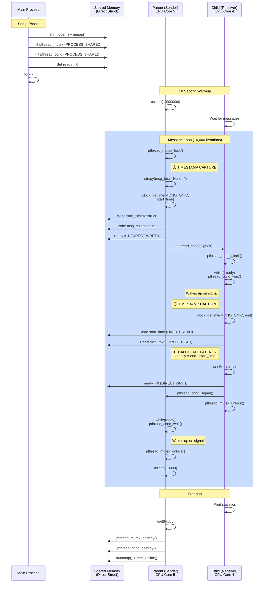
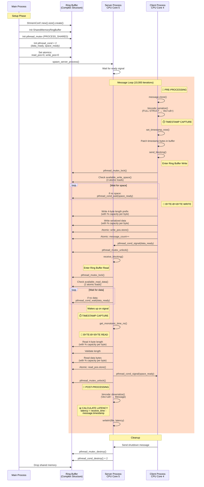
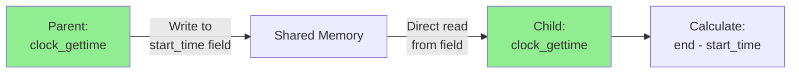

# Shared Memory Performance Analysis: C vs Rust

## Overview

This document provides a detailed comparison of the C (Nissan) and Rust shared memory implementations, including performance analysis and flow diagrams.

---

## C Program (Nissan) - Message Flow

---

## Rust Program - Message Flow

---

## Architectural Comparison

---

## Timestamp Flow

### C Program

### Rust Program

---

## Performance Comparison

### Latency Results (No Load)

| Implementation | Mean | Min | Max |
|----------------|------|-----|-----|
| **C (Nissan)** | 6.45 µs | 4.95 µs | 27.34 µs |
| **Rust Blocking** | 8.62 µs | 7.14 µs | 91.77 µs |
| **Difference** | +33.6% | +44.2% | **+235.6%** |

### Overhead Breakdown

#### Send Path Overhead

| Step | C | Rust | Delta |
|------|---|------|-------|
| Prepare | 0 µs | 5-15 µs (clone + serialize) | +5-15 µs |
| Timestamp | 0.2 µs | 0.7 µs (patch bytes) | +0.5 µs |
| Space Check | 0 µs | 0.2 µs (3 atomics) | +0.2 µs |
| Write Data | 0.05 µs (memcpy) | 2-5 µs (byte-by-byte) | +2-5 µs |
| Update State | 0.01 µs | 0.11 µs (atomics) | +0.1 µs |
| **TOTAL** | **~1-2 µs** | **~9-23 µs** | **+8-21 µs** |

#### Receive Path Overhead

| Step | C | Rust | Delta |
|------|---|------|-------|
| Data Check | 0.01 µs (flag) | 0.11 µs (atomics) | +0.1 µs |
| Read Data | 0.05 µs (direct) | 2-5 µs (byte-by-byte) | +2-5 µs |
| Deserialize | 0 µs | 3-8 µs (bincode) | +3-8 µs |
| **TOTAL** | **~1 µs** | **~6-14 µs** | **+5-13 µs** |

---

## Root Causes of Performance Difference

### 1. Serialization Overhead (5-15 µs)
- C: Direct struct access, no serialization
- Rust: Full bincode serialization of Message struct
- **Impact:** Major contributor to latency

### 2. Ring Buffer Complexity (4-10 µs)
- C: Simple flag-based protocol
- Rust: Circular buffer with modulo arithmetic
- **Impact:** Byte-by-byte operations prevent optimization

### 3. Memory Allocation (0-20 µs)
- C: No allocation per message
- Rust: Clone + serialize allocates heap memory
- **Impact:** Under load, allocator can add 10-20 µs

### 4. Atomic Operations (0.5-2 µs)
- C: Minimal atomics (mutex only)
- Rust: 6 atomic loads + 2 stores per message
- **Impact:** Under contention, can add latency

---

## Recommendations

### To Match C Performance:
1. **Remove bincode serialization** - use `#[repr(C)]` struct
2. **Simplify to direct struct access** - like C program
3. **Use memcpy instead of byte-by-byte** - leverage hardware

### Immediate Improvements (Without Redesign):
1. **Pre-allocate serialization buffer** - reuse Vec
2. **Batch memcpy operations** - reduce modulo ops
3. **Profile under load** - identify hotspots

---

## Files

- C Implementation: `/home/mcurrier/auto/nissanvsrustylat/nov6/res_rustcodechangetomatchCtimestamps_origC_andswapaffinrust/sharedmemory_mutex_priority_50_affinity_CPU45_10s.c`
- Rust Implementation: `src/ipc/shared_memory_blocking.rs`
- Test Results: `/home/mcurrier/auto/nissanvsrustylat/nov6/res_rustcodechangetomatchCtimestamps_origC_andswapaffinrust/`

---

**Generated:** November 6, 2025
**Analysis by:** Claude Sonnet 4.5

